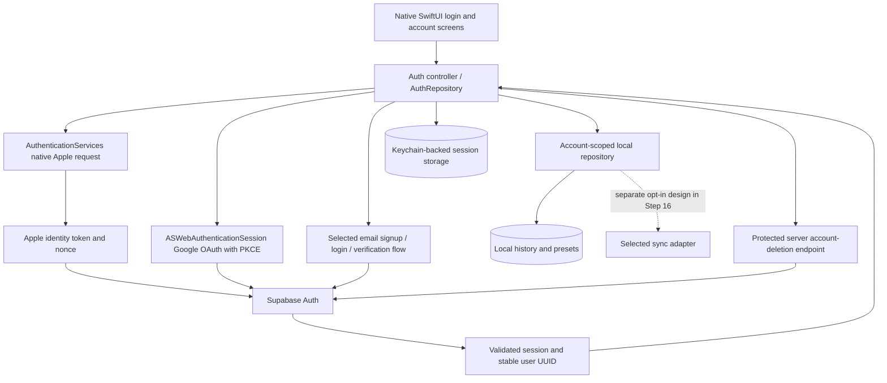
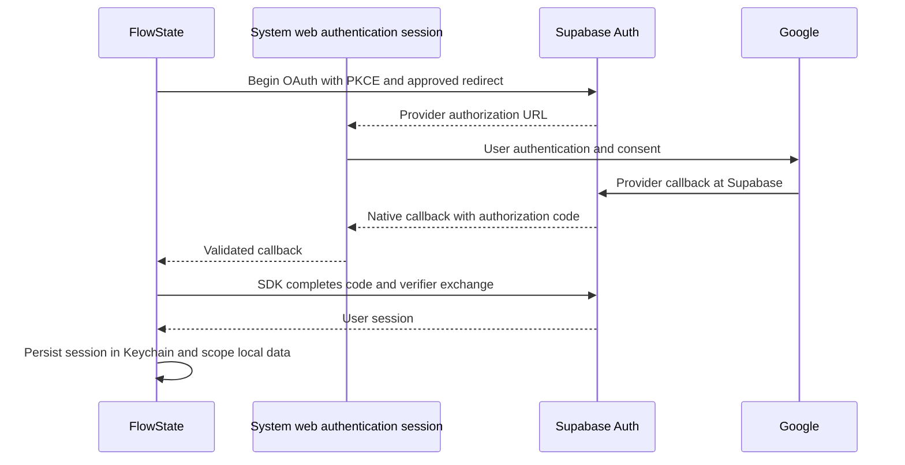

# FlowState authentication architecture and setup

Updated: 2 October 2026. Status: requirements and integration plan; no live Supabase project connection or authentication implementation yet.

## Backend decision and scope

Supabase Auth is the selected managed backend for Apple, Google and email accounts. It supports native macOS Sign in with Apple and provides a Swift OAuth API. We can retain the native SwiftUI/AppKit application and local timer/history without building an authentication server. Authentication is separate from optional cloud data sync. [Supabase Apple guide](https://supabase.com/docs/guides/auth/social-login/auth-apple), [Swift OAuth API](https://supabase.com/docs/reference/swift/auth-signinwithoauth).

Use the official [Supabase Swift SDK](https://github.com/supabase/supabase-swift) as a pinned Swift Package Manager dependency. Verify the selected release's API, secure-storage integration, deployment compatibility and license before adding it. Create an injectable AuthRepository and a Supabase adapter; keep the pure timer domain and real-time audio path independent of network/provider code. The exact adapter/package placement should fit the current package boundaries rather than forcing a package per screen.

## Pending product decisions

The following are unanswered; do not implement a default as though the user approved it:

- Access policy: mandatory sign-in versus allowing unsigned local use with account features available after login.
- Email method: email/password, including verification and reset, versus passwordless email code/magic link.
- Local ownership: how sign-out, account switching and deletion affect retained history; whether/how existing local or guest history can be explicitly adopted by an account.
- Release bundle ID, callback URL, Apple Developer team and development/production project separation.

Public setup inputs and provider configuration block live login; they do not block documenting the tasks or creating mocks once the relevant behavior decisions are resolved.

## Components and data flow

The auth controller exposes typed states such as restoring, signed out, authenticating, awaiting email verification, signed in and recovery. Its observer owns session refresh and cancellation. Screens and menu bar entry points obey the chosen access policy. Authentication failure must not manufacture focus time or duplicate timer state.

### Apple

Use native AuthenticationServices with a cryptographically random nonce; send its hash to Apple and exchange the identity token plus original nonce with Supabase. Configure the native App ID/capability and accepted audience, and verify on a correctly signed Mac build. Capture a supplied name on first authorization and preserve it later; support private relay and revocation. Native-only Apple sign-in does not require the web OAuth secret-rotation setup. [Native Apple setup and limitations](https://supabase.com/docs/guides/auth/social-login/auth-apple).

### Google

Use Supabase's Swift OAuth integration with ASWebAuthenticationSession and PKCE. Google redirects to Supabase's provider callback; Supabase then redirects to the registered native app callback. These are distinct addresses. Validate scheme/host/path against the approved native callback, use the SDK flow's anti-forgery/PKCE state, and exchange a returned code once. Handle cancellation, timeout, delayed and duplicated callbacks. Confirm the pinned SDK's code-exchange behavior to avoid exchanging a code twice. [Swift OAuth API](https://supabase.com/docs/reference/swift/auth-signinwithoauth), [Google provider setup](https://supabase.com/docs/guides/auth/social-login/auth-google).

### Email

For email/password: signup, confirmation/resend, login, password reset/recovery and password update are one complete scope. For passwordless: implement the selected code or magic-link flow and its verification/resend behavior. Confirm link handling across launch states and the supported same-device/cross-device behavior of the selected PKCE/template flow. Keep the exact email method pending user choice. [Password authentication](https://supabase.com/docs/guides/auth/passwords), [Passwordless email](https://supabase.com/docs/guides/auth/auth-email-passwordless).

Supabase's default email sender is restricted and unsuitable for production external-user delivery. Configure custom SMTP and a verified sender in the dashboard; test confirmation/recovery and Apple relay delivery where relevant before release. [Supabase SMTP requirements](https://supabase.com/docs/guides/auth/auth-smtp).

## Configuration inputs

Provide these when the project is ready:

| Input | Use | Where it belongs |
| --- | --- | --- |
| Supabase Project URL | Identifies the Auth endpoint | Public native client configuration |
| Supabase publishable key (`sb_publishable_…`) | Identifies the client project | Public native client configuration |
| Approved Mac bundle ID | Native identity, signing and Apple audience | Xcode / Apple Developer / Supabase settings |
| Apple Developer Team ID | Signing and capability configuration | Xcode / Apple Developer |
| Approved native callback URL | Returns OAuth/email links to the app | App URL registration and exact Supabase redirect allowlist |
| Email method and login policy | Determines flows and app access | Recorded product decisions |

The current generated bundle identifier is `dev.focusapp.scaffold`; do not use it as a production decision without user confirmation. `.env.example` records placeholder fields. A native Swift application does not automatically read `.env`; Step 18 must implement deliberate typed build/runtime loading and validate the selected environment. Never ship release configuration accidentally pointing to a development project.

Only the Project URL and publishable key are needed to initialize the Supabase client. Client publishable keys are not privileged secrets; server secret/service-role keys have elevated access and must never be embedded in the Mac app. [Supabase API key model](https://supabase.com/docs/guides/getting-started/api-keys).

Configure Google OAuth client credentials in Google Cloud and Supabase, not in the Mac client's environment. Configure Apple native audiences/capabilities for the chosen native flow; web Apple credentials are only needed if that flow is later selected. Keep administrative keys, Apple private keys, provider client secrets, SMTP passwords and signing secrets out of the repository, Graphify inputs and chat.

### Owner setup checklist

Completion state lives only in [Agents/TASKS.md](../Agents/TASKS.md). The preparation order is:

1. Create the Supabase project and provide its Project URL and publishable key.
2. Confirm login policy, email method, approved native identity and callback.
3. Enable the Google provider; configure consent/test users and its Supabase callback in Google Cloud.
4. Configure the Apple native capability/audience and signing team; verify the Supabase provider configuration for native ID-token exchange.
5. Allowlist exact environment-specific native redirects in Supabase; register and validate the matching native URL handler. Do not use broad production wildcards.
6. Configure email confirmation/recovery or passwordless templates, custom SMTP and sender verification for the selected email flow.
7. After implementation, verify all three flows with a signed build and record evidence before checking off Step 18.

## Session security and data ownership

Persist session credentials in Keychain using the pinned SDK's supported storage adapter; do not claim the SDK default meets this requirement without inspecting it. Never store tokens in UserDefaults, source, exported history or diagnostic logs. Handle relaunch, expiration/refresh, offline behavior, revoked credentials and sign-out with explicit tests.

Use the stable Supabase user UUID as account ownership, never email (Apple relay addresses and provider emails may differ). Before login ships, migrate existing local history/presets with an approved ownership/adoption policy. Scope every repository read/write, export and statistic to the current local owner, or use separate stores; test switching between two users. Preserve accurate active-session handling and prevent a previous account's data from appearing after switching. Signing in must not implicitly upload app/domain activity.

If remote profile/history tables are introduced, define least-privilege grants and ownership Row Level Security before client access; test unauthenticated and cross-user denial. UI filtering is not authorization. Authentication alone needs no custom history schema. [Supabase RLS](https://supabase.com/docs/guides/database/postgres/row-level-security).

Account deletion requires an explicitly confirmed client action and a protected server endpoint that validates the caller's token and operates only on that caller's account. Administrative credentials stay server-side. Define deletion/retention, any identity unlinking and Apple token revocation requirements before implementing the endpoint. Test linking with reauthentication and verified identity; never merge local/remote accounts solely by matching email.

## Delivery and feasibility

This fits the current native stack; there is no need to replace SwiftUI or the audio engine. The substantial work is session lifecycle, native callbacks, signed Apple configuration, email recovery/delivery and correct account data ownership, rather than the three login buttons. All tasks and acceptance gates are in [Step 18](../Agents/TASKS.md).

Step 18 depends on the foundation and native shell, can progress alongside timer/audio work once its product decisions are resolved, and must pass before release hardening and optional sync. Real provider testing remains blocked until project/provider configuration and signing are ready. No duration estimate is asserted before those inputs and the SDK integration spike are complete.
