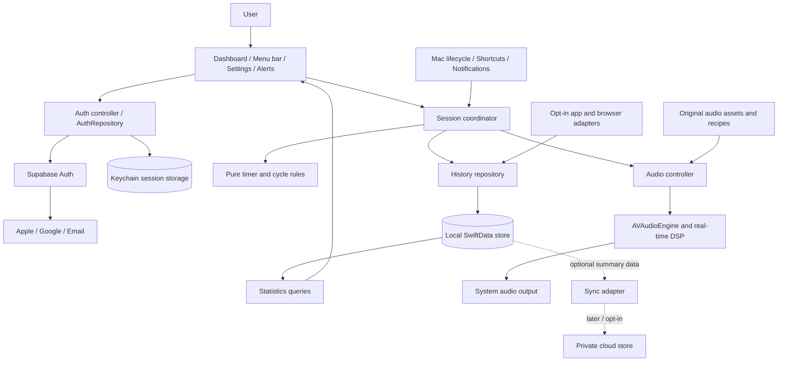
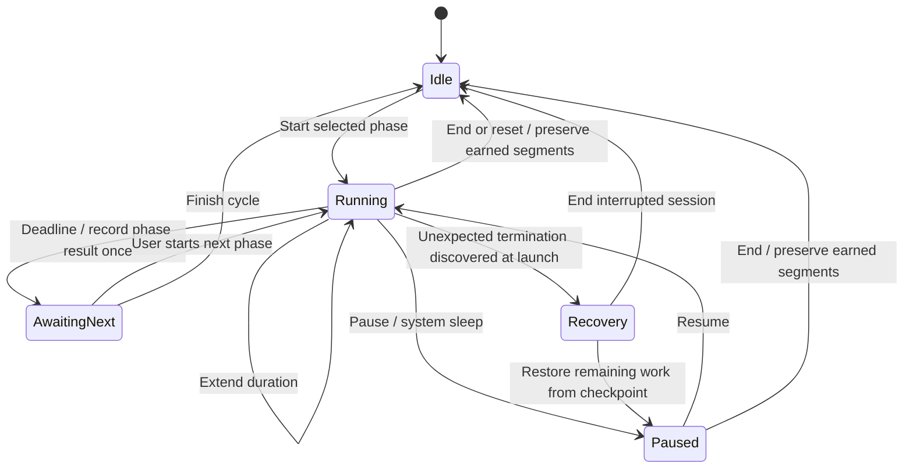
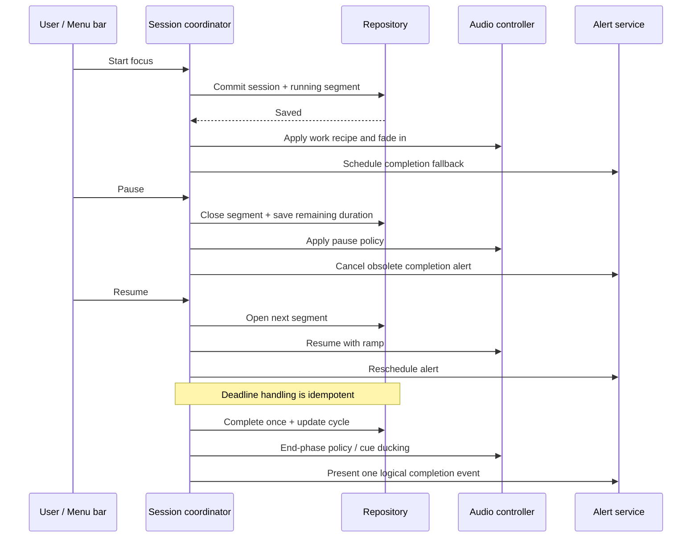
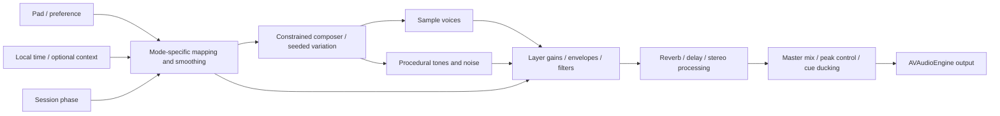
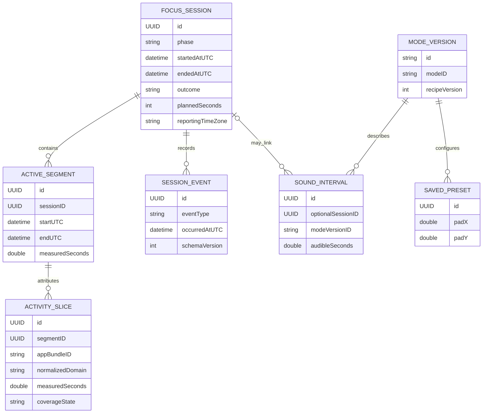
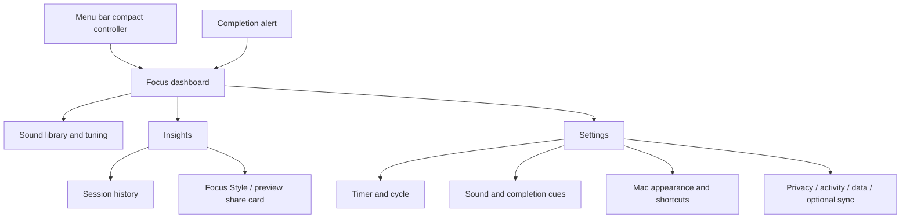
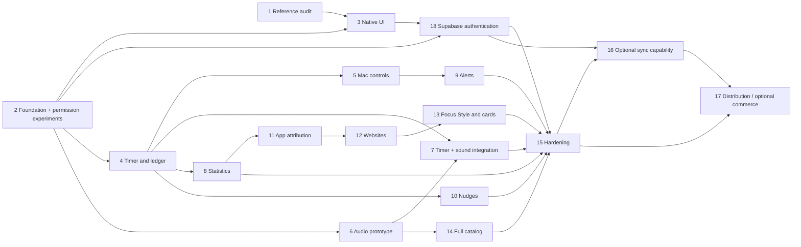

# Native Mac focus app — implementation plan

**Date:** 1 October 2026  
**Status:** supplied-reference review complete; live Endel audit deferred by user choice; exact per-mode audio remains unverified.  
**Product:** a native macOS app combining adaptive focus sound, Kofe Flow-style timers, and trustworthy focus statistics. The product name is FlowState (selected 2 October 2026).

**2 October authentication planning update:** Supabase Auth is selected for Apple, Google and email accounts; implementation and provider configuration remain pending. Agent completion tracking now lives in [Agents/TASKS.md](../Agents/TASKS.md).

**2 October implementation update:** the native project and initial screen scaffold are now implemented. See [scaffold analysis](../docs/SCAFFOLD.md) and [verification record](../docs/VERIFICATION.md). The original planning narrative below remains an evidence record; full Step 2/3 exit gates and later product features are not claimed complete.

This plan supersedes the browser-platform architecture in the [earlier Endel study](endel-web-requirements-feasibility.md). That study remains the provisional sound catalog and evidence record. The requested deliverable is now a Mac application. The initial study was planning only; the later scaffold implementation is recorded above. Authentication is planned in this update and is not yet implemented.

The [supplied-reference analysis](REFERENCE_ANALYSIS.md) records the five Kofe Flow screenshots and 33-second Endel mobile recording. Its observed findings supersede earlier uncertainty about Focus pad labels, visible sync settings and the captured timer options. The [checksum inventory](reference-inventory.json) preserves provenance. Current project: `/Users/senukadeneth/Local/local-projects/FlowState`.

## 1. Product outcome and research status

The app should let someone start a focused work block from the menu bar, hear adjustable evolving sound, transition cleanly into a break, and later understand when and how long they focused. The full desktop scope includes the reference's convenience features, not merely a countdown and chart.

Use native macOS controls and window behavior, restrained system materials, clear typography, and a compact layout. Keep detailed controls available without making the primary session screen busy.

### Evidence available

| Evidence | Findings and limitations |
| --- | --- |
| Prior Endel research | Provisional 16-soundscape / 17-scenario web catalog; public engine and pad evidence. Exact assets and DSP mappings remain unknown. |
| Browser retry | Saved site-permission setting rejected access. User subsequently chose supplied-reference analysis with live verification deferred. |
| Kofe Flow official website/support | Public desktop feature descriptions; useful for scope, not proof of every interaction detail. |
| Kofe Flow App Store listing | Version 4.8 visible during research, including release history for newer features. |
| Kofe Flow privacy policy | Effective 28 August 2026; describes optional sync and local activity data. |
| User-provided reference folder | All five screenshots and 25 sampled frames covering the Endel recording reviewed. Inventory and findings saved; cleanup recorded separately. |
| Endel recording | Focus mobile pad: Fluid → Structured horizontally, Easy → Intense vertically, Apply button. Current web equivalence and exact acoustic mappings unverified. |
| Kofe screenshots | Manual transitions, visible sync toggle, captured 50/10/20-minute settings and four-block cadence, eight style labels, four shortcut groups, 360-day history. Captured settings are not proven factory defaults. |
| Local developer environment | macOS 27.0.1, Apple Silicon, Swift 6.4 command-line toolchain. Full Xcode 27.0 is now selected; the earlier CommandLineTools-only observation was superseded by the [2 October verification](../docs/VERIFICATION.md). |

**Evidence terminology:** observed = visible in supplied references; documented = supported by a public primary source; proposed = a design decision for this app; unresolved = requires further evidence or an experiment. Nothing in this plan claims measured feature parity.

### Outstanding inputs

1. Exact Endel assets, per-mode DSP curves and acoustic Apply/preview behavior remain unresolved; the supplied video establishes only the Focus mobile controls.
2. Live browser verification is deferred by explicit user choice. Revisit only when requested and access is available; no alternate browser or indirect access is part of this review.
3. FlowState branding is selected; confirm distribution channel and commercial model before release. They do not block domain, UI or audio prototypes.
4. Supply Supabase public configuration, release identity and provider setup; choose mandatory sign-in policy and email method. These block live authentication, not this planning update. See [setup inputs](../docs/AUTHENTICATION.md#configuration-inputs).

## 2. Reference feature inventory

Kofe Flow documents focus and break timers, menu bar operation, nudges, local statistics, optional activity attribution and share cards. [Product site](https://www.kofeflow.com/), [Support](https://www.kofeflow.com/support)

The following are requirements for our product. Supplied-reference details are incorporated below; unseen defaults, limits and runtime edge cases remain unresolved. “Opt-in” means the user can enable a feature; it does not remove it from the full implementation scope.

| ID | Capability to implement | Source / qualification | Delivery step |
| --- | --- | --- | --- |
| T01 | Focus, short break, long break; adjustable durations and cadence | Observed 50/10/20 minutes and four-block cadence; limits unknown | 4 |
| T02 | Start, pause, resume, reset, end, skip and extend by five minutes | Product/menu bar/App Store descriptions | 4 |
| T03 | Manual phase transitions, breaks and long-break cycle progress | Screenshot explicitly says manual transitions only; support/App Store | 4 |
| T04 | Daily cycle reset | Publisher release history; exact midnight semantics unresolved | 4 |
| M01 | Menu bar countdown, quick controls; Timer only, Cup, Target, Bolt, Hourglass, Pulse, Ring and Phase styles | Screenshots 4–5; Ring/Phase graphics partly clipped; timer stays visible | 5, 9 |
| M02 | Configurable Start/Pause/Resume, Stop/Reset, Take/Skip Break and Show Dashboard shortcuts | Screenshot 5; Show must not change timer state | 5 |
| M03 | Optional Dock icon, launch at login and show/hide dashboard at launch | Support | 5 |
| N01 | Local completion notifications and one selectable sound for both focus and break completion | Screenshots 3–4; available sounds not shown | 9 |
| N02 | Top-of-screen completion alert with quick actions; disable in settings | Publisher release history: Notch Alert | 9 |
| N03 | Smart suggestions to start or pause using idle activity | Product/App Store | 10 |
| N04 | Habit reminders with suppression/cooldown rules | Publisher release history; exact rules unresolved | 10 |
| H01 | Today totals, session history, streak and cycle progress | Product/App Store | 8 |
| H02 | Today hourly graph, 7-day/range charts, partial/live time separate from completed blocks; app durations and percentages | Screenshots 1–2; aggregation rules specified below | 8 |
| H03 | Optional focused foreground-app attribution | Product/privacy policy | 11 |
| H04 | Optional website-domain attribution and browser support registry | Product/privacy policy; exact supported set to audit | 12 |
| H05 | Focus Style/persona, local share-card generation | Product/App Store; classifier rules undisclosed | 13 |
| P01 | Onboarding; light, dark, system appearance; native settings and Help entry | Appearance/support heading observed; onboarding documented | 3, 9 |
| P02 | Local timer/history and offline behavior; mandatory-login versus optional account access awaits user choice | Reference allowed local operation; account requirement added by user | 2, 18 |
| I01 | Apple, Google and email signup/login, session lifecycle and account controls | User requirement, 2 October 2026; Supabase Auth selected, email method pending | 18 |
| P03 | 360-day local history, reset and privacy controls | Screenshot 5; export/import are our additions | 8, 13 |
| X01 | Optional timer sync; history sync separately documented | Sync timer setting observed in screenshot 3; actual operation untested | 16 |
| X02 | One-time Pro purchase/restore, if matching commerce is wanted | Support; monetization not yet selected for our app | 17 |
| A01 | Evolving soundscape catalog and timed scenarios | Prior Endel evidence | 6, 14 |
| A02 | Two-axis tuning and Apply: Fluid/Structured, Easy/Intense for Focus; accessible equivalent sliders | Observed in mobile recording; other modes and DSP curves unresolved | 6, 7, 14 |
| A03 | Volume, mute, pause, seamless mode transitions and saved tuning | Product requirements; exact reference behavior unresolved | 6, 7 |
| A04 | Time/context adaptation and mode-linked visualization | Endel product documentation; desktop input subset proposed | 7, 14 |
| I01 | Timer-linked audio plus independent listening | Combined-product requirement | 7 |
| I02 | Sound usage statistics alongside focus statistics | Combined-product addition; no efficacy claim | 8 |

Release history adds daily cycle resets, preservation of elapsed focus when ending early, new browser support, and the configurable completion overlay. [Publisher listing and release history](https://apps.apple.com/us/app/kofe-flow-pomodoro-timer/id6762003285?mt=12)

Screenshot 3 resolves one earlier discrepancy: the supplied Kofe build visibly exposes an enabled Sync timer setting described as aligning Mac and iPhone. Successful syncing, pairing and history synchronization are not demonstrated. The privacy policy describes timer/history sync while keeping detailed Mac activity local. Preserve that capability in the backlog; our mobile client remains outside scope. [Kofe Flow privacy policy](https://www.kofeflow.com/privacy)

### Scope boundary

Full desktop scope includes the rows above, including features delivered after the first usable milestone. Mobile clients, Live Activities on iPhone, watch integration, native task/project management, website blocking, and calendar planning are not part of this request. Multi-Mac sync can be delivered without adding a mobile app. Product analytics telemetry is not needed to reproduce user functionality and is omitted from the initial design.

Commerce is a business decision, not a prerequisite for accessing functionality in development. No core feature should be lost merely because the reference marks it Pro.

## 3. Native technology decisions

| Concern | Selected approach | Reason / constraint |
| --- | --- | --- |
| Platform and language | Native macOS, Swift 6 language mode, strict concurrency | Direct access to Mac audio, windows, notifications and lifecycle |
| Compatibility | Proposed minimum macOS 15; test macOS 15, 26 and 27 | SwiftData/Observation baseline with availability-guarded newer visuals; confirm supported hardware before shipping |
| UI | SwiftUI, Observation, system SF Symbols and typography | Native layout, accessibility and appearance; avoid custom replacements for standard controls |
| Mac integration | Small AppKit adapters; MenuBarExtra; NSPanel only for completion overlay | Keep platform-specific behavior outside business logic |
| Audio | AVAudioEngine, AVAudioPlayerNode, AVAudioSourceNode, AVAudioUnit effects | Native sample playback, procedural sources and audio graph |
| Custom DSP | Small preallocated C/C++ DSP core only where profiling requires it | Keep the real-time path predictable; avoid a large audio framework initially |
| Persistence | SwiftData with VersionedSchema, SchemaMigrationPlan and an isolated repository | Local storage, migration discipline, replaceable persistence boundary |
| Statistics UI | Swift Charts plus accessible textual totals | Native chart interaction and coherent data presentation |
| Settings | AppStorage/UserDefaults for preferences; database for history | Do not put session records or activity timelines in preference keys |
| Authentication | Official Supabase Swift SDK through pinned SPM dependency; AuthRepository boundary | Managed Apple/Google/email identity; provider setup and email method still pending |
| Native login / session secrets | AuthenticationServices for Apple and Google web session; Security/Keychain for tokens | Native Apple ID-token exchange, Google PKCE and secure session restoration; public config only in client |
| Notifications | UserNotifications | Local alerts with explicit authorization and denial handling |
| Login item | SMAppService.mainApp | Native system-managed login setting |
| Shortcuts | KeyboardShortcuts via Swift Package Manager, pinned version | Mature recorder and global hotkey handling; review license and compatibility |
| App attribution | NSWorkspace activation/lifecycle notifications | Attribute foreground app time without collecting window content |
| Idle detection | Coarse Core Graphics time-since-input query | Nudge input without recording keystrokes or pointer trajectories |
| Website attribution | Browser adapters, permissions spike first; narrowly scoped browser extension if needed | No universal native API for every browser's active domain |
| Rendering share cards | SwiftUI ImageRenderer or AppKit-backed export; native share sheet | Entirely local rendering with preview/redaction |
| Tests and diagnostics | Swift Testing, XCTest UI tests, Instruments, OSLog/signposts | Verify domain rules, integration and energy/audio behavior |
| Packaging | Xcode project for app; local Swift packages for isolated modules | Native signing, resources, entitlements and reproducible builds |

Apple documents the menu-bar scene, AVAudioEngine's node graph, and Swift Charts' native chart support. [MenuBarExtra / window session](https://developer.apple.com/videos/play/wwdc2022/10061/), [AVAudioEngine](https://developer.apple.com/documentation/avfaudio/avaudioengine), [Swift Charts](https://developer.apple.com/documentation/charts)

Use the latest stable Xcode compatible with the build machine, then record its exact version in CI. Do not require beta-only APIs. Native system components adopt the platform design; custom glass effects must be guarded by availability. On older supported macOS versions, use ordinary native materials and controls. [Apple: adopting Liquid Glass](https://developer.apple.com/documentation/technologyoverviews/adopting-liquid-glass)

SwiftData provides versioned schema migration and model actors for serialized model access. The selected library reports sandbox-compatible global shortcuts and includes a native recorder. [SwiftData schema](https://developer.apple.com/documentation/swiftdata/schema), [ModelActor](https://developer.apple.com/documentation/swiftdata/modelactor), [KeyboardShortcuts](https://github.com/sindresorhus/KeyboardShortcuts)

### Decisions recorded as architecture decision records

- **ADR-001:** native SwiftUI/AppKit application. A web runtime would increase integration work for the requested Mac behavior.
- **ADR-002 (amended):** local-first timer/history with Supabase Auth for requested accounts. Mandatory sign-in versus optional local use awaits user choice; authentication does not implicitly enable sync. See [accepted auth direction](../docs/adr/002-authentication.md).
- **ADR-003:** a single session state machine controls all timer surfaces.
- **ADR-004:** immutable time segments underpin every statistic; displayed counters are derived.
- **ADR-005:** original/licensed hybrid audio with versioned recipes. No dependency on private Endel APIs or extracted assets.
- **ADR-006:** activity collection is separately opt-in and stays local; absence of permission never blocks a timer.
- **ADR-007:** isolate native capabilities and real-time DSP behind narrow interfaces. Use dependency injection, not a service locator.
- **ADR-008:** delivery increments preserve the complete target scope; each incomplete feature remains traceable.

These are proposed decisions. Revisit an ADR when an experiment supplies contrary evidence, with the tradeoff recorded.

## 4. Architecture and engineering principles

Use a modular monolith: one app process with clear boundaries. No microservices, plugin system, or generic workflow engine is needed. Separate pure rules from operating-system adapters so time and lifecycle behavior can be tested deterministically.



**Ownership:** the coordinator serializes user actions and lifecycle events. It owns the authoritative session state and emits explicit effects for persistence, audio and notifications. Views display state and send intents. Audio never updates statistics directly.

Use a pure reducer, conceptually `reduce(state, event, clockReading) -> (state, effects)`. Typed events prevent an incidental UI rerender from counting a session or advancing a cycle. Repositories and system adapters implement protocols at module boundaries. Small view models can expose display state; do not duplicate timer logic in each screen.

**Concurrency:** UI models live on MainActor. Persistence uses an isolated repository/model actor. Audio graph preparation and asset decoding run off the UI thread. The real-time callback uses prepared buffers and parameter snapshots; it must not await actors, allocate memory, access SwiftData, log, take a contended lock, or perform file/network I/O. Control messages cross through a bounded, tested handoff. Apple explicitly warns against blocking calls in device render blocks. [AVAudioSourceNode render initializer](https://developer.apple.com/documentation/avfaudio/avaudiosourcenode/init(renderblock:))

**Suggested project layout:**

```text
FlowState.xcodeproj
App/                       composition root, scenes, entitlements, resources
Features/                  Dashboard, SoundLibrary, Insights, History, Settings, Authentication
Packages/FocusDomain/      timer, cycle, sessions, statistic definitions
Packages/FocusPersistence/ SwiftData models, migrations, repositories
Packages/FocusAudio/       engine, recipe interpreter, sample loader, DSP bridge
Packages/MacIntegration/   notifications, shortcuts, login, activity, overlay
Resources/Audio/           owned assets, recipes, manifests, license records
Tests/                     domain, integration, migration, DSP, UI
docs/adr/                  recorded decisions and tradeoffs
Agents/                    authoritative checklist and completion evidence
AGENTS.md                  checklist, Graphify and project guidance
```

Do not introduce package boundaries for every screen. Add abstraction where a test, alternate implementation or platform boundary needs it. Pin third-party dependencies, keep a license inventory, and avoid global mutable state.

## 5. Timer behavior contract

Observed controls are reflected below. Unseen edge-case policies are proposed contracts for implementation, not measured Kofe behavior.

Provide a reference-aligned preset of 50-minute focus, 10-minute short break, 20-minute long break after four completed focus blocks. These are the captured values, not established factory defaults. Durations and cycle count are configurable; bounds and increment sizes require a product specification before implementation. All phase transitions are manual, matching screenshot 4. Settings changes apply to the next phase; extending applies to the active phase.

Represent state with orthogonal fields: `phase = focus | shortBreak | longBreak` and `status = idle | running | paused | awaitingNext | recovery`. This avoids a separate implementation for every combination.



The recovery arrow describes what the next launch detects, not code executed during a crash. A skipped break advances to a ready focus phase. Skipping/ending focus saves its earned time but does not count as completion. Manual break selection closes or pauses work only through an explicit documented action. Cycle progress advances once per completed focus block, never because of UI refresh or duplicate notification delivery.

Reset stops the current session and returns its phase to the configured duration. Already earned work remains in history with an interrupted outcome. Deleting history is a separate explicit operation.

Use elapsed monotonic time while the process runs, not a counter decremented by callbacks. Persist UTC timestamps, accumulated active duration and remaining duration, not a process-local clock instant. ContinuousClock keeps moving during system sleep and its instants are not portable across launches; account for sleep explicitly. [Apple clock documentation](https://developer.apple.com/documentation/swift/continuousclock)

Proposed system policy: automatically pause the timer on system sleep and user-session deactivation, stop attribution, and ask for resume after wake. Screen dimming alone must not stop an audio-only sleep soundscape. Screen-lock behavior needs an early supported-API experiment; do not equate display sleep with screen lock. Idle auto-pause is a separate optional preference; Smart Nudge only suggests by default. Reading without typing must still count unless the user chose otherwise.

A daily cycle reset occurs when starting a new focus phase on a new local date. It does not interrupt an ongoing block. The new-day phase's cycle attribution uses its start-date bucket. A focus block crossing midnight contributes time to both days but completion to its ending day. Keep these rules explicit in tests.

On process termination, persist the final segment when possible. Checkpoint a running segment about every 10 seconds and on lifecycle/actions; tune after profiling. After a crash, count only through the last reliable checkpoint. Do not credit unattended wall time between the crash and relaunch. Display a recoverable interruption instead of inventing a completed session.

## 6. Timer and sound integration

Audio has its own `stopped | loading | playing | paused | failed` state. Listening duration and focused work duration are separate measures.

| Action | Timer-linked sound | Independent listening |
| --- | --- | --- |
| Start focus | Fade in selected work recipe if sound enabled | Existing listening continues |
| Pause focus | Default fade to silence; preference can retain sound | Unchanged |
| Start short/long break | Crossfade to selected break recipe or silence | Unchanged |
| Complete phase | Persist result once; play one completion cue; prepare next phase | Cue can temporarily duck listening |
| Mute/pause sound | Timer continues and still earns focus time | Only listening state changes |
| Change pad or sound | Continue timer; smooth parameter/recipe transition | Smooth audio transition |
| Audio failure/device removal | Show error; focus time continues; avoid unexpected loud output | Pause/recover sound explicitly |
| Quit app | Close session and audio; no further time credited | Stop sound |



If persistence fails, keep an in-memory session but clearly mark history as unsaved and retry without duplicating records. Do not freeze audio or silently report the work as stored. All command effects carry stable IDs where repetition could cause duplicate history, phase transitions or alerts.

## 7. Native adaptive audio design

Retain the 33-entry provisional catalog from the earlier study. A small initial sound set is a milestone, not a replacement for the requested full scope. First validate Focus, adjustable Dynamic Focus, Relax, Sleep, procedural noise and rain, then expand into distinct recipes.

Exact Endel assets and mappings remain unavailable. The following graph is our proposed engine:



Each mode definition contains compatible layers, musical constraints, variation bounds, pad mappings, phase curves and asset references. Each audio asset has a checksum, ownership/license, sample rate, channel layout, loudness, key where relevant, loop boundaries and allowed pitch/tempo treatment. Version definitions so changes do not silently alter saved presets or historical labels.

The supplied Focus recording establishes the pad directions: **Fluid → Structured** from left to right and **Easy → Intense** from bottom to top. Represent them as normalized structure and intensity coordinates. The observed Apply button requires a defined draft/commit contract. Proposed native behavior is live preview while dragging, Apply to persist, and Cancel to restore prior tuning; audio preview timing and cancellation were not established in the reference. Provide accessible sliders and keyboard equivalents. Position-dependent instrument eligibility should be possible. Exact DSP curves remain unknown; other modes need their own specifications. Keep master volume separate.

Structure affecting rhythmic regularity, quantization and pattern repetition, and intensity affecting event density, transient prominence and spectral brightness, are **our proposed sound-design mappings**. They are not recovered Endel internals. See the pad diagram, video timestamps and evidence limits in [REFERENCE_ANALYSIS.md](REFERENCE_ANALYSIS.md).

Use gain/envelope smoothing, musical-boundary pattern changes, preloading and bounded voice counts. Preserve reverb tails during crossfades. Avoid pitch shifts caused by speeding up a mixed sample unless explicitly intended. Noise needs defined spectral targets; a preset name alone is not a DSP specification. Binaural mode requires correct separate-channel generation, not global amplitude pulsing.

Initial technical targets: audible control response within 150 ms before deliberate smoothing, no clipped transitions, normal active decoded audio below 250 MB, and no dropouts in two-hour work/eight-hour listening tests on target hardware. These are targets to validate, not achieved measurements. Test system sample-rate changes, AirPods/Bluetooth switches, external audio devices, screen sleep and rapid mode changes.

Prototype the graph with native nodes first. Add custom DSP only for a justified requirement. Decode off the real-time thread and schedule audio against the engine's sample/host time. AVAudioSourceNode provides a callback for procedural rendering. [Apple source-node documentation](https://developer.apple.com/documentation/avfaudio/avaudiosourcenode)

The full catalog needs sound-design work and listening acceptance per mode. Endel artist collaborations require suitable rights or distinctly original replacements. Similar controls or spectra do not establish the same cognitive effects. The earlier report records the relevant public patent; commercial implementation still needs the applicable content and technology review.

## 8. Data model and statistics definitions

**Account ownership addition (Step 18):** before login ships, migrate local history/presets to explicit account-scoped ownership based on Supabase user UUID; choose partitioned stores or equivalent enforced repository scoping. Determine handling of existing unowned scaffold records and guest history with the user first. Email is not an account key. Auth credentials stay in Keychain. Signing in alone never uploads this local ledger; cloud schema and RLS belong to the separately approved sync/profile scope. See [authentication data rules](../docs/AUTHENTICATION.md).



Relationships are conceptual; enforce actual invariants in repositories and database tests. Store resumable checkpoints separately from finalized segments. Keep events compact for troubleshooting transitions; this is not a requirement to implement a full event-sourcing framework. Cache aggregates only when query performance justifies them and retain a rebuild path.

| Metric | Definition for our app |
| --- | --- |
| Focus time | Sum measured durations of active focus segments within the reporting range; include interrupted/partial work |
| Completed blocks | Number of focus sessions reaching their configured deadline exactly once |
| Started blocks | Number of focus sessions started in range; breaks excluded |
| Completion rate | Completed divided by started for a stated cohort; ongoing blocks shown separately; show “—” when denominator is zero |
| Daily average | Focus duration divided by number of calendar days in the selected range; do not silently exclude zero days |
| Current streak | Consecutive local dates with at least one completed focus block; if today is incomplete, count back from yesterday |
| App time | Foreground attribution intersected with active focus segments only |
| Domain time | A subset of its browser's attributed time; never add it again to total focus time |
| Unattributed time | Active focus time without reliable app/domain coverage; visible, not discarded |
| Sound listening | Actual audible intervals, independent of focus time; mute/pause excluded |
| Focus by sound | Active focus intersected with audible sound intervals; includes a visible silent-focus bucket |

For completion rates, use sessions that started in the selected range and indicate results as of now; do not divide completions ending today by starts today when they come from different cohorts. For daily block counts, use completion date. Name these distinctions clearly.

Store UTC boundaries plus a stable reporting time zone, initially the system zone. Split intervals at calendar midnight using Calendar, not 86,400-second arithmetic. Treat daylight-saving days as their actual durations. Re-bucketing after an explicit reporting-zone change must be deterministic. Split measurement across a system-clock adjustment rather than allowing negative or inflated wall-clock intervals.

Do not double-count duplicate events, active UI previews, sync echoes or retries. Give sessions, segments and completion events stable IDs. Validate nonnegative duration, at most one active phase, non-overlapping activity slices, and domain time no greater than its browser attribution within measurement tolerance.

Present Today with an hourly histogram, 7 days / 30 days / custom range with daily bars, a calendar activity view, session history, streaks, app/domain ranking and sound usage. The screenshots establish Today/7D/Range controls; the menu behind Range is unseen. Show duration and percentage per app, with active focus duration in the same range as the denominator and explicit unattributed time. These exact denominator rules are ours, not inferred from rounded screenshot percentages. Keep live time visibly separate from completed blocks. Include empty, partial-data and permission-disabled states. Add versioned CSV/JSON export/import and delete-history; these are proposed additions.

Match the observed 360-day history window with a documented calendar-day retention policy. Completed-session totals and charts must state their range. Define how pruning interacts with streaks, exports and optional sync before implementation; do not silently retain supposedly deleted detailed activity in aggregates or logs. Reset History requires explicit confirmation and leaves ordinary appearance/timer preferences intact under our proposed contract.

## 9. Mac activity, nudges, alerts and privacy

### Foreground application tracking

Subscribe to the shared NSWorkspace notification center and sample the currently frontmost application at start/resume. Close the previous slice when focus changes. Do not count every open app or background audio app. Stop collection when paused, on breaks, asleep, deactivated or disabled. Use bundle ID/display name; do not collect document titles. [NSWorkspace activation notification](https://developer.apple.com/documentation/appkit/nsworkspace/didactivateapplicationnotification)

### Website attribution

Run an early sandboxed feasibility experiment for supported browsers. Start with Safari and Chrome, then audit the reference-supported list including Brave Origin, Helium and Orion. Do not promise support for every Chromium derivative from its engine alone. Each adapter needs capability detection, timeouts, denied/revoked-permission behavior and a maintained compatibility test.

Prefer explicit browser scripting APIs with the appropriate Automation consent and sandbox entitlements when supported. Where that is inadequate, assess an optional narrow browser extension with native messaging; user installation is an additional product step. Accessibility scraping is not the default approach. Apple's sandbox documentation requires specific entitlements for outbound Apple Events. [Apple event sandbox entitlements](https://developer.apple.com/library/archive/documentation/Miscellaneous/Reference/EntitlementKeyReference/Chapters/AppSandboxTemporaryExceptionEntitlements.html)

Normalize domains immediately. Do not persist full URL paths, query parameters, fragments or page titles. Use a maintained public-suffix-aware approach if aggregating registrable domains. Never launch a closed browser just to query it. Pause queries when attribution is inactive. If private/incognito state cannot be detected reliably, disable domain collection for that adapter until a safe behavior is established. Keep browser-app attribution and show domain coverage as unavailable.

### Smart Nudge and habit reminders

Use coarse idle age, enabled work hours, recent session state and a cooldown. Suggestions may start focus or offer to pause; automatic action requires a separate user-selected setting. Reading is not necessarily inactivity. Avoid repeated suggestions after dismissal, during a break, when screen/session is inactive or when notifications are suppressed. Core Graphics exposes time since the last input event without requiring storage of its content. [Time since input documentation](https://developer.apple.com/documentation/coregraphics/cgeventsource/secondssincelasteventtype(_:eventtype:))

### Completion alerts

Local notifications and a native non-activating NSPanel should represent one completion event. The top-edge panel needs actions such as Start Break, Extend, and Dismiss. It must work on a display without a notch, handle menu bar/notch safe areas, multiple displays and Spaces, and avoid stealing keyboard focus. Respect reduced motion and the user's alert preference. Prevent duplicate chimes when a system notification and panel both appear.

Use a scheduled local notification as a fallback, cancelling/rescheduling on pause, extend or reset. Test sleep/wake delivery and avoid presenting an obsolete completion after recovery. Login configuration uses SMAppService and reflects the system's actual authorization state. [SMAppService](https://developer.apple.com/documentation/servicemanagement/smappservice)

### Permission design

| Capability | Request timing | Denied state |
| --- | --- | --- |
| Notifications | When enabling completion/habit alerts | In-app completion status still works |
| App attribution | Separate opt-in with a data explanation | Focus statistics remain available |
| Browser Automation / extension access | When enabling a supported domain adapter | Browser-level time only |
| Launch at login | When enabling the setting | Reflect system status; no repeated prompt |
| Optional sync | When enabling sync | Fully functional local timer/history |
| Optional location/weather | Only if contextual adaptation is enabled | Use local time and manual sound settings |

Ordinary audio output does not require microphone recording. Avoid introducing microphone, screen-recording or input-recording permissions for the core product. Verify actual API permission requirements on each supported OS during the early experiment.

## 10. Native interface plan



**Dashboard:** one large readable countdown, phase label, cycle progress, primary start/pause control, compact secondary actions, selected sound and tuning access. Today totals should provide context without competing with the timer.

**Menu bar:** stable-width countdown with phase icon, concise controls and navigation. Window closure leaves the app running. Quit is explicit. Hide/show Dock behavior must not create duplicate windows or orphan the menu item.

**Sound library:** clear distinction between endless listening and timed scenarios. Show downloaded/available state, mode-specific controls and saved presets. Free listening remains accessible without manufacturing focus history.

**Insights:** clear unit labels, explain partial work, show the selected reporting range, and keep app/domain details secondary. Prefer a small number of legible charts over a dense dashboard. Focus Style is a transparent heuristic with an “insufficient data” state, not a psychological diagnosis or a model prediction requiring a cloud call.

**Visual language:** standard sidebar/toolbar/window controls, system font and SF Symbols, a restrained accent, monospaced countdown digits, generous spacing and system materials for navigation/control surfaces. Avoid placing every chart and text card on a translucent background. Use native Liquid Glass where available and appropriate; honor increased contrast, reduced transparency and reduced motion. All pad functions need keyboard and accessible slider equivalents.

## 11. Step-by-step implementation backlog

The complete, authoritative checklist is now [Agents/TASKS.md](../Agents/TASKS.md). It preserves all original Steps 1–17, their exit criteria and existing completion marks, and adds Step 18 for Apple, Google and email authentication. Update completion status there, not in a second copy of the backlog. Record verification in [Agents/COMPLETION_LOG.md](../Agents/COMPLETION_LOG.md).

Step 18 begins after foundation and native shell work and must pass before release hardening and cloud sync. Stable step numbers do not imply strict numeric execution order. See [authentication architecture/setup](../docs/AUTHENTICATION.md) and [agent workflow](../Agents/README.md).

## 12. Dependency and delivery diagram



Arrows show technical dependencies. Independent work can overlap once shared interfaces and behavior contracts are settled.

Suggested checkpoints: **A:** runnable timer and native shell; **B:** accepted audio with timer integration; **C:** trustworthy statistics and local Mac features; **D:** full sound catalog, working authentication and production hardening; **E:** selected sync/commerce/distribution scope. Do not call checkpoint B the complete requested product.

## 13. Verification strategy and release gates

| Layer | High-value verification |
| --- | --- |
| Pure domain | Table-driven state transitions; fake-clock timing; randomized command sequences preserve invariants |
| Statistics | Golden datasets for interrupted sessions, cross-midnight, DST, duplicate events, partial data and timezone changes |
| Persistence | Migration fixtures, transaction failure, recovery checkpoints, export/import round trips and idempotent save |
| Audio | Offline render tests for peak/silence/ramp behavior, noise spectrum, stereo routing and deterministic seeded fixtures |
| Integration | One user action through UI/menu/shortcut/notification produces one consistent result |
| Mac lifecycle | Sleep/wake, lock experiment, multiple displays/Spaces, relaunch, login item denied, output-device changes |
| Permissions | Fresh install, opt-out, denial and revocation for each optional feature |
| UI | VoiceOver, keyboard pad alternatives, reduced motion/transparency, light/dark, empty/error/long-title states |
| Performance | Instruments Time Profiler, Allocations, energy metrics, audio continuity and repeated mode changes |
| Sound quality | Extended listening across pad regions and complete scenario phases; reviewer notes and user acceptance |

Proposed performance budgets: less than 1 second to start a cached sound, less than 150 ms control response before intended ramps, no unintended peak above the chosen −1 dBTP target in tested renders, and stable memory over repeated sessions. Hardware, sample rate and testing conditions must accompany results. CPU/energy budgets should be fixed after profiling the first native prototype rather than quoted without a baseline.

Definition of done per feature: implemented behavior, accessible UI, saved-state/permission/error handling, meaningful tests, documentation updated, and no unexplained discrepancy against its requirement. Test completion does not substitute for listening acceptance.

## 14. Main risks and planned experiments

| Risk | Early experiment / response |
| --- | --- |
| Exact Endel sound unavailable | Original audio prototype and an explicit content-equivalence decision before full catalog production |
| Pad seems responsive but does not sound useful | Repeated listening at a fixed grid with controlled random seed/context |
| Focus time inflates after pause/sleep/crash | Build segment accounting and recovery tests before statistics UI |
| Browser support varies or sandbox access fails | Signed sandboxed spike on intended browsers before committing distribution |
| Foreground activity mistaken for productivity | Label it as app/domain time; do not claim it measures attention or task quality |
| Native UI becomes heavily customized | Use system components first; evaluate against Apple accessibility and window conventions |
| Too much CPU/battery used by audio/visuals | Bounded voices, preallocated DSP, hidden-window rendering suppression and Instruments runs |
| App Store distribution limits an integration | Resolve in Step 2; retain an adapter boundary and evaluate direct distribution openly |
| Supplied references show only some runtime behavior | Use the saved audit; resolve hidden behavior before claiming strict parity |
| Sync double-counts sessions | Stable IDs, ownership/revisions, idempotency and conflict tests before enabling sync |

Rough planning allowance, assuming an experienced Mac engineer plus audio/DSP expertise and part-time design/QA: 1–2 weeks for technical/audio spikes; 6–10 weeks for a useful integrated native milestone; 3–6 months for the broader local catalog, analytics and Mac feature set. Sync, commerce, exact content licensing and unresolved reference differences can add work. These are planning ranges, not commitments; re-estimate after Steps 1, 2 and 6.

## 15. Current completion record

- [x] Retried normal browser permission; recorded the saved-setting block and documented how to clear it.
- [x] Researched public Kofe Flow desktop features, including release-history additions and sync inconsistency.
- [x] Selected a proposed native technology stack and architecture.
- [x] Defined timer/audio integration, data accounting, native UI direction and software-engineering boundaries.
- [x] Created an ordered implementation backlog with diagrams and acceptance gates.
- [x] Inspect all five screenshots and sampled frames spanning the supplied Endel recording; save checksum inventory and findings.
- [x] Move Reference-Src to Trash after preserving findings; recoverable destination recorded in reference-cleanup.json.
- [ ] Live web pad/mode inspection deferred by the user's choice to proceed with supplied references.
- [ ] Implement/build the app — outside this analysis-and-plan turn.
  - 2 October update: native scaffold built and tested; full app implementation remains outstanding. See the linked scaffold record.

The next implementation phase is native foundation and timing/audio experiments. Exact sonic equivalence and full runtime parity remain unverified; supplied-reference analysis is complete. The original Reference-Src folder has been moved to Trash; the recoverable destination is recorded in reference-cleanup.json.
