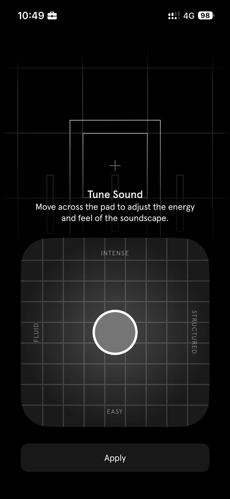
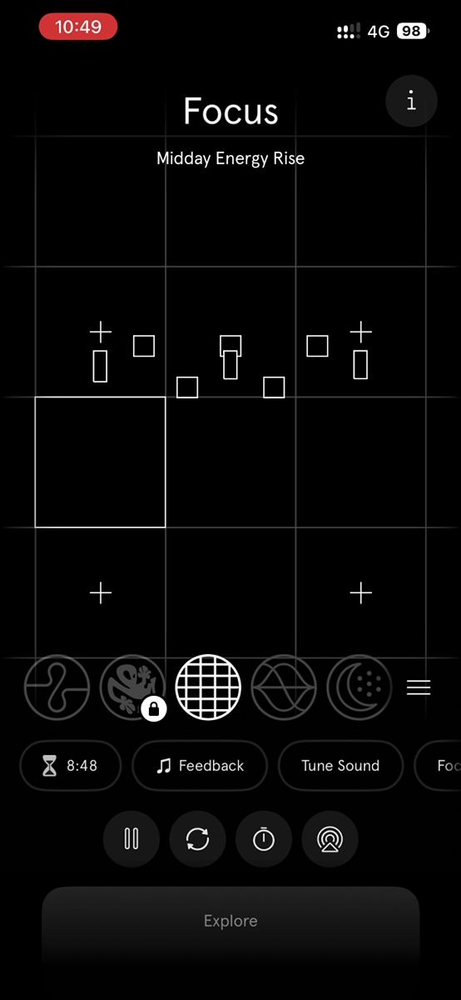
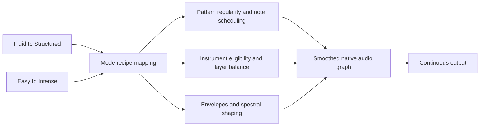

# Supplied reference analysis — native Mac focus app

**Reviewed:** 1 October 2026. **Scope:** five Kofe Flow screenshots and one Endel mobile screen recording supplied by the user. Live browser verification is deferred by the user's instruction to proceed with these files.

This supplement corrects and extends the [implementation plan](IMPLEMENTATION_PLAN.md) and [earlier Endel study](endel-web-requirements-feasibility.md). The screenshots are product evidence, not executable source code. Neither app's version is visible in these files. Do not equate the recorded mobile experience with the current Endel website.

## What the evidence establishes

The Endel Focus pad has a horizontal **Fluid → Structured** axis and a vertical **Easy → Intense** axis, with an Apply control. Kofe Flow exposes manual timer transitions, adjustable durations and cadence, live statistics, optional activity tracking, completion alerts, global shortcuts, appearance/launch settings and a timer-sync setting. These observations substantially narrow the earlier unknowns.

Exact Endel source audio, synthesizer settings, musical scheduling, pad-to-DSP curves and mappings for other modes remain unidentified. A recording of a mixed output cannot uniquely identify the original instruments, stems or synthesis algorithm. Functional recreation is feasible; exact sonic equivalence is not established.

## Evidence inventory and method

The six original filenames, sizes and SHA-256 checksums are preserved in [reference-inventory.json](reference-inventory.json). All five screenshots are 2624 × 1944. The video is 33.218 seconds, 1170 × 2532, approximately 59.61 frames/second, with one video track and one audio track.

Each screenshot was inspected visually. The video was decoded locally with Apple's AVFoundation into 25 evenly spaced frames covering 0–33.12 seconds. All sampled frames were reviewed, with larger views of representative states. This is sampled visual inspection, not frame-by-frame playback. The audio track was decoded successfully and contained nonzero samples; no claim of a listening comparison, isolated-stem extraction, or measured acoustic pad mapping is made.

Two representative video frames are retained as small evidence illustrations. No reference audio is incorporated into an app or sound library.

## Kofe Flow observations and implementation consequences

| File / evidence | Observed behavior or control | Required consequence |
| --- | --- | --- |
| Timer 1 | Running Focus countdown at 08:36; Pause action; Timer, Stats and Settings navigation | One timer state shared across dashboard, menu bar and shortcuts; prominent pause/resume action |
| Timer 1 | Today 41m, “0 sessions + live”; streak 0 days; last-seven-days spark chart | Count active/partial focus time separately from completed blocks; show live contribution without duplicating persisted time |
| Timer 1 | Top Activity icons; Product Builder persona with share icon; Unlock Pro | Local app summary and persona/share surface. Persona algorithm and unlock workflow are not demonstrated |
| Timer 2 | Today / 7D / Range controls and share action | Range-aware statistics and shareable summary; choices inside Range remain unseen |
| Timer 2 | Focus time, completed focus blocks, streak and top activity; hourly focused-time graph for Today | Today needs an intraday time histogram, not only a daily total; weekly/range views need appropriate time buckets |
| Timer 2 | App Split with icon, duration, horizontal bar and percentage | Rank app use during active focus; define percentage denominator and show untracked time |
| Timer 2 | Browser Activity off, Enable button; states URLs and page titles are never saved | Independent browser consent and visible disabled state; persist normalized domains only, with no full URLs/titles in storage or logs |
| Timer 3 | Focus 50m, short break 10m, long break 20m, cadence four focus sessions; plus/minus controls | Provide a reference-aligned 50/10/20/four preset. These are captured settings, not proof of factory defaults or step sizes/limits |
| Timer 3 | Sync timer enabled; description aligns Mac and iPhone timer | Timer-sync UI is observed, resolving the earlier uncertainty about whether a setting exists. Successful transport and history sync are untested; our mobile client remains outside scope |
| Timer 3 | Notify on completion and Notch Alert separately enabled | Independent controls for system notification and top-edge alert; one logical completion event |
| Timer 4 | Track browser activity off; Open at login on | Separate optional collection from login behavior; accurately reflect system permission/status |
| Timer 4 | Show dashboard on launch and Show Dock icon marked Pro | Implement both capabilities. Product monetization is a separate decision |
| Timer 4 | System / Light / Dark theme; System selected | Standard native appearance preference |
| Timer 4 | Explicit “Manual session transitions only” | Completion enters a ready/awaiting-next state. Remove automatic phase transitions from reference-parity requirements |
| Timer 4 | One alert sound for both focus and break completion; current System sound and Choose action | Unified completion-sound selection and preview; available sound choices are not visible |
| Timer 4–5 | Timer only, Cup, Target, Bolt, Hourglass, Pulse; Ring/Progress and Phase/State labels partly visible in Timer 5 | Preserve eight named menu-bar styles. Timer text remains visible in every option. Exact Ring/Phase graphics and any animation are unverified |
| Timer 5 | Start / Pause / Resume; Stop / Reset; Take / Skip Break; Show Kofe Flow shortcut groups | Four configurable command bindings; Show brings the dashboard forward without changing timer state |
| Timer 5 | Shortcut text says existing bindings remain saved but Pro is required to record/run | If commerce is implemented, preserve bindings when entitlement changes; no need to reproduce a paywall for core development |
| Timer 5 | History: 15 completed focus sessions, saved locally for last 360 days; Reset History | Retention-aware local history, completed-block count and explicit destructive reset confirmation; 15 is sample data, not a target |
| Timer 5 | Support Kofe Flow heading at the bottom | Provide a native Help/support entry; unseen support links/actions are not identified |

The captured 41m with zero completed blocks is consistent with live or partial focus; it does not prove the exact accounting algorithm. The 15-session History count need not conflict with the Today count because the ranges differ. Preserve these distinctions in both labels and tests.

Screenshots do not demonstrate Smart Nudge, habit-reminder settings, all menu actions, every Pro dialog, history-reset confirmation, duration bounds, keyboard conflicts or actual sync. Keep the earlier public documentation as evidence for those features, with runtime behavior unverified.

## Endel Focus pad: observed interaction

| Axis / control | Observation |
| --- | --- |
| Horizontal | Fluid at left, Structured at right |
| Vertical | Easy at bottom, Intense at top |
| Handle | Circular marker with outline; changes position throughout the recording |
| Visual feedback | Marker is darker near Easy and lighter near Intense in sampled frames; background geometry animates |
| Confirmation | Apply button remains below the pad; the sheet closes near the end of the recording |
| Mode identity | Final screen reads Focus, with the contextual label Midday Energy Rise |

Sampled path: center at 0s; upper-right near 2.77s; lower-right near 5.54s; lower-left near 11.07s; upper-left near 15.23s; near center-left around 20.76s; upper-right around 24.91s; lower-middle around 29.07s. By 33.12s the main Focus screen is visible. This shows freely varying two-dimensional input across all quadrants. It does not establish whether release snaps to a grid or the exact timing of an Apply press.

The recording starts inside Tune Sound. It does not show opening the sheet, reopening it to test persistence, cancellation, other modes' pads, or a controlled comparison with a fixed generative seed. Neither audio preview-before-Apply nor the point at which a new tuning becomes persistent can be conclusively established from the sampled images.

The final player also visibly exposes Tune Sound, Feedback, a timer-like readout, an information button, pause, circular-arrows, stopwatch and audio-route icons, a mode carousel and Explore. The icons' presence is observed; the precise action of the circular-arrows button and the partly clipped trailing chip are not established. Audio route selection can use Mac system routing; recreating iPhone navigation is outside the requested platform scope.

## Translating the pad into a native engine

Use normalized coordinates `structure ∈ [0,1]` and `intensity ∈ [0,1]`, with intensity increasing upward. These names and directions follow the recording. They are perceptual controls, not a specification for two literal audio waveforms.

**Proposed implementation, not recovered Endel internals:** structure can influence rhythmic regularity, quantization and pattern repetition; intensity can influence event density, transient prominence, envelope shape and bounded spectral brightness. Both may affect layer selection. Keep master volume separate and constrain loudness changes. Mode recipes define the permitted ranges and combinations; do not apply one generic mapping to all 33 provisional catalog entries.

Support smoothly overlapping region weights rather than abruptly enabling a waveform when the pointer crosses an invisible boundary. Prototype with original/licensed loops, note samples and procedural voices. A single crossfade among four complete tracks is technically possible but would not establish equivalence with the documented generative system or account for independent variation within layers.

For the Mac tuning sheet, specify two state levels: **draft tuning** and **committed tuning**. A live-preview-and-Apply interaction is a proposed product contract to validate, not an observed acoustic fact. Apply saves the draft; a Cancel action added for native window behavior restores the prior tuning. Provide two accessible sliders and keyboard control as equivalent inputs. Sound preview must not reset the focus timer or restart the audio engine on each drag event.

Before implementing a mode, record: asset provenance, voicing rules, musical constraints, allowed parameter ranges, pad mapping version, preview/commit policy and acceptance examples at center/four corners/edge midpoints. Validate with a fixed seed and context so inherent variation is not mistaken for a pad effect. Separate two questions: does the DSP meet its specification, and is the result pleasant and useful over an extended session?

## Native design direction

Use a SwiftUI sidebar with Focus, Sound Library, Insights and History; place preferences in a native Settings window. The Focus view combines monospaced timer digits, phase/progress, sound selection and a compact tuning control. Keep shortcuts, menu bar and the main window synchronized through one session coordinator.

Retain the reference's useful information hierarchy: session controls first; Today/live time, streak and activity underneath; detailed charts in Insights. Replace its oversized cards, floating navigation and decorative illustration with system spacing, toolbar/sidebar conventions, SF Symbols, native controls and restrained materials. These are new design decisions, not claims about how Kofe is implemented.

## Remaining evidence gaps and completion criteria

| Gap | Impact / next evidence needed |
| --- | --- |
| Current web Endel behavior | Live audit remains deferred by user choice; do not claim mobile/web parity |
| Exact sound assets and DSP per mode | Original sound design or authorized technical/content access required for exact matching |
| Apply persistence and acoustic preview timing | Reopen-and-cancel interaction plus controlled listening test |
| Other modes and scenarios | Inspect each accessible mode; current recording demonstrates Focus only |
| Kofe unseen settings and edge cases | Additional screenshots or authorized runtime inspection if strict behavioral identity is required |
| Timer/history sync | Setting exists; transport, conflicts, pairing and successful cross-device behavior remain untested |

This is sufficient to update the native architecture and a traceable implementation backlog. It is not sufficient to certify an exact clone. No app implementation was performed during this review.

## Reference cleanup

Review and checksum inventory are complete. The original `Reference-Src` directory was moved to `/Users/senukadeneth/.Trash/Reference-Src` through macOS FileManager.trashItem after checking its six files. Its workspace path is absent. The operation is recoverable through Trash; no permanent deletion or Trash emptying was performed. See the [cleanup record](reference-cleanup.json). Two representative extracted frames remain with this report, and analysis intermediates remain under work/.
